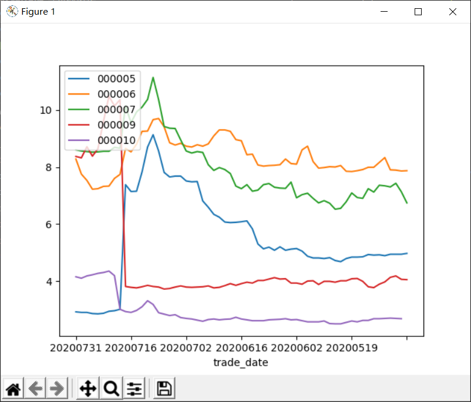

# 组员信息  
## 组长：
胡存浩-U201811633  
## 组员：  
胡至祎-U201811631  
梅畅-U201811635  
董佳鑫-U201811660  

# 代码说明  
本次作业我们小组使用了baostock和tushare两个网站所提供的端口获取了数据，首先分析了**浦东银行(sh600000)**2019年整年的数据走势 

## 从baostock上获取数据
```python

from datetime import date
import baostock as bs
import pandas as pd

#### 登陆系统 ####
lg = bs.login()
# 显示登陆返回信息
print('login respond error_code:'+lg.error_code)
print('login respond  error_msg:'+lg.error_msg)

#### 获取沪深A股历史K线数据 ####

rs = bs.query_history_k_data_plus("sh.600000",
    "date,code,open,high,low,close,preclose,volume,amount",
    start_date='2019-01-01', end_date='2019-12-31',
    frequency="d", adjustflag="3")
    # code：股票代码，sh或sz.+6位数字代码，或者指数代码，如：sh.601398。sh：上海；sz：深圳。此参数不可为空；
    # fields：指示简称，支持多指标输入，以半角逗号分隔，填写内容作为返回类型的列。详细指标列表见历史行情指标参数章节，日线与分钟线参数不同。此参数不可为空；
    # start：开始日期（包含），格式“YYYY-MM-DD”，为空时取2015-01-01；
    # end：结束日期（包含），格式“YYYY-MM-DD”，为空时取最近一个交易日；
    # frequency：数据类型，默认为d，日k线；d=日k线、w=周、m=月、5=5分钟、15=15分钟、30=30分钟、60=60分钟k线数据，不区分大小写；指数没有分钟线数据；周线每周最后一个交易日才可以获取，月线每月最后一个交易日才可以获取。
    
print('query_history_k_data_plus respond error_code:'+rs.error_code)
print('query_history_k_data_plus respond  error_msg:'+rs.error_msg)

#### 打印结果集 ####
data_list = []
while (rs.error_code == '0') & rs.next():
    # 获取一条记录，将记录合并在一起
    data_list.append(rs.get_row_data())
result = pd.DataFrame(data_list, columns=rs.fields)

#### 结果集输出到csv文件 ####   
result.to_csv("C:\\Users\\Mark Hu\\Desktop\\trial\\_A_stock_k_data.csv", index=False)
print(result)

#### 登出系统 ####
bs.logout()

# 导入数据分析库pandas
```
## 对获取的数据的简单处理
```python

import pandas as pd

# 从本地导入数据，这里用的是相对路径，如果你的程序和文件不在同一个文件夹里请用绝对路径
df = pd.read_csv('_A_stock_k_data.csv')
# 查看数据
df.head()
# 剔除缺失数据
df = df.dropna()
df.head()
# 取出时间
raw_time = pd.to_datetime(df.pop('date'), format='%Y/%m/%d')
```
## 绘制股票走势折线图
```python
from matplotlib import pyplot as plt
import seaborn as sns

# 折线图：股票走势
plt.plot(raw_time, df['close'])
plt.xlabel('Time')
plt.ylabel('Share Price')
plt.title('Trend')
plt.show()
```
所获折线图  
## 绘制散点图  
```python
from matplotlib import pyplot as plt
import seaborn as sns
df = pd.read_csv('_A_stock_k_data.csv')
plt.scatter(df['volume'], df['close'])
plt.xlabel('Volume')
plt.ylabel('Share Price')
plt.title('Volume & Share Price')
plt.show() 
```
所获散点图  

## 绘制涨跌幅度  
```python
from matplotlib import pyplot as plt
print(df)
daily_return = df['close'][0::1].pct_change().dropna()
plt.plot(raw_time[0::1][0:100], daily_return[0:100])
plt.xlabel('Time')
plt.ylabel('Rise and Fall')
plt.show()
```
所获涨跌幅度图  
## 通过tushare获取多只股票数据进行对比  
### 转换数据日期类型  
```python
def date_to_num(dates):
    num_time = []
    for date in dates:
        date_time = datetime.datetime.strptime(date,'%Y-%m-%d')
        num_date = date2num(date_time)
        num_time.append(num_date)
    return num_time
```
### 获取多组数据并处理  
```python
import pandas as pd

from matplotlib import pyplot as plt
import seaborn as sns

# 获得多条股票的数据，进行数据可视化分析
import tushare as ts

token = 'b040357522d745da48a561d627b0b977ee49b471c60e916f3cb9d4be'  # 通过注册获得的token，输入代码中用于获得股票数据
ts.set_token(token)  # 进行初始化

pro = ts.pro_api()

df = pro.daily(ts_code='000005.SZ, 000006.SZ, 000007.SZ, 000009.SZ, 000010.SZ', start_date='20200501', end_date='20200801') # 选取2020年5月1日到2020年8月1日的5支股票进行数据可视化处理
df.head(10)
print(df.head(10))


# 把时间和序号混杂在一起的股票数据分开，以便于画图
sz5 = df[::5].set_index('trade_date')
sz6 = df[1::5].set_index('trade_date')
sz7 = df[2::5].set_index('trade_date')
sz9 = df[3::5].set_index('trade_date')
sz10 = df[4::5].set_index('trade_date')

sz5.head()
```
### 绘制多条股票数据的折线对比图  
```python
fig, ax = plt.subplots()

sz5.plot(ax=ax, y='close', label='000005')
sz6.plot(ax=ax, y='close', label='000006')
sz7.plot(ax=ax, y='close', label='000007')
sz9.plot(ax=ax, y='close', label='000009')
sz10.plot(ax=ax, y='close', label='000010')

plt.legend(loc='upper left')
plt.show()
```
所得折线图  

### 绘制多条股票数据的箱形图  
```python
closedf = pd.DataFrame()
closedf = pd.concat([closedf, sz5['close'], sz6['close'], sz7['close'], sz9['close'], sz10['close']], axis=1)  # 横向拼接数据(axis=1)
closedf.columns = ['000005', '000006', '000007', '000009', '000010']
closedf.plot(kind='box')
plt.show()

# 000007、000009、000010的箱形图出现了几个“O”，这表示这3支股票中存在温和的异常值，于是使用describe()方法对这3组数据的均值、分位数、标准差、最值等进行初步分析
print(sz7.describe())  
print(sz9.describe())
print(sz10.describe())
```
所得箱型图  
### 绘制多只股票的对比直方图  
```python
mean_share_list = [sz5['close'].mean(), sz6['close'].mean(), sz7['close'].mean(), sz9['close'].mean(), sz10['close'].mean()] 
mean_share_series = pd.Series(mean_share_list, index=['000005', '000006', '000007', '000009', '000010'])
mean_share_series.plot(kind='bar')
plt.xticks
plt.show()
```
所获对比折线图  

## K线绘制