# 组员信息  
## 组长：
胡存浩-U201811633  
## 组员：  
胡至祎-U201811631  
梅畅-U201811635  
董佳鑫-U201811660  

# 代码说明  
本次作业我们小组使用了baostock和tushare两个网站所提供的端口获取了数据，首先分析了**浦东银行(sh600000)**2019年整年的数据走势 

## 从baostock上获取数据
```python

from datetime import date
import baostock as bs
import pandas as pd

#### 登陆系统 ####
lg = bs.login()
# 显示登陆返回信息
print('login respond error_code:'+lg.error_code)
print('login respond  error_msg:'+lg.error_msg)

#### 获取沪深A股历史K线数据 ####

rs = bs.query_history_k_data_plus("sh.600000",
    "date,code,open,high,low,close,preclose,volume,amount",
    start_date='2019-01-01', end_date='2019-12-31',
    frequency="d", adjustflag="3")
    # code：股票代码，sh或sz.+6位数字代码，或者指数代码，如：sh.601398。sh：上海；sz：深圳。此参数不可为空；
    # fields：指示简称，支持多指标输入，以半角逗号分隔，填写内容作为返回类型的列。详细指标列表见历史行情指标参数章节，日线与分钟线参数不同。此参数不可为空；
    # start：开始日期（包含），格式“YYYY-MM-DD”，为空时取2015-01-01；
    # end：结束日期（包含），格式“YYYY-MM-DD”，为空时取最近一个交易日；
    # frequency：数据类型，默认为d，日k线；d=日k线、w=周、m=月、5=5分钟、15=15分钟、30=30分钟、60=60分钟k线数据，不区分大小写；指数没有分钟线数据；周线每周最后一个交易日才可以获取，月线每月最后一个交易日才可以获取。
    
print('query_history_k_data_plus respond error_code:'+rs.error_code)
print('query_history_k_data_plus respond  error_msg:'+rs.error_msg)

#### 打印结果集 ####
data_list = []
while (rs.error_code == '0') & rs.next():
    # 获取一条记录，将记录合并在一起
    data_list.append(rs.get_row_data())
result = pd.DataFrame(data_list, columns=rs.fields)

#### 结果集输出到csv文件 ####   
result.to_csv("C:\\Users\\Mark Hu\\Desktop\\trial\\_A_stock_k_data.csv", index=False)
print(result)

#### 登出系统 ####
bs.logout()

# 导入数据分析库pandas
```
## 对获取的数据的简单处理
```python

import pandas as pd

# 从本地导入数据，这里用的是相对路径，如果你的程序和文件不在同一个文件夹里请用绝对路径
df = pd.read_csv('_A_stock_k_data.csv')
# 查看数据
df.head()
# 剔除缺失数据
df = df.dropna()
df.head()
# 取出时间
raw_time = pd.to_datetime(df.pop('date'), format='%Y/%m/%d')
```
## 绘制股票走势折线图
```python
from matplotlib import pyplot as plt
import seaborn as sns

# 折线图：股票走势
plt.plot(raw_time, df['close'])
plt.xlabel('Time')
plt.ylabel('Share Price')
plt.title('Trend')
plt.show()
```
所获折线图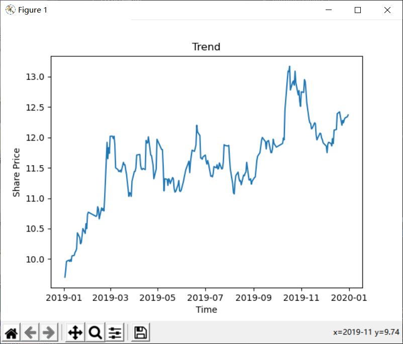  
## 绘制散点图  
```python
from matplotlib import pyplot as plt
import seaborn as sns
df = pd.read_csv('_A_stock_k_data.csv')
plt.scatter(df['volume'], df['close'])
plt.xlabel('Volume')
plt.ylabel('Share Price')
plt.title('Volume & Share Price')
plt.show() 
```
所获散点图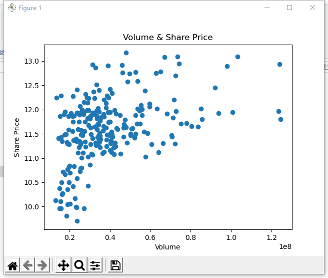  

## 绘制涨跌幅度  
```python
from matplotlib import pyplot as plt
print(df)
daily_return = df['close'][0::1].pct_change().dropna()
plt.plot(raw_time[0::1][0:100], daily_return[0:100])
plt.xlabel('Time')
plt.ylabel('Rise and Fall')
plt.show()
```
所获涨跌幅度图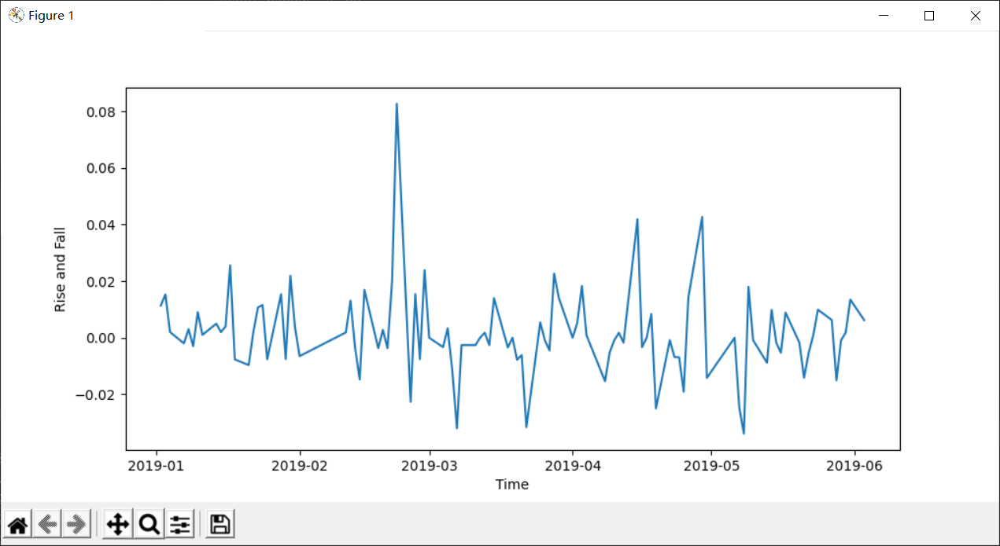  
## 通过tushare获取多只股票数据进行对比  
### 转换数据日期类型  
```python
def date_to_num(dates):
    num_time = []
    for date in dates:
        date_time = datetime.datetime.strptime(date,'%Y-%m-%d')
        num_date = date2num(date_time)
        num_time.append(num_date)
    return num_time
```
### 获取多组数据并处理  
```python
import pandas as pd

from matplotlib import pyplot as plt
import seaborn as sns

# 获得多条股票的数据，进行数据可视化分析
import tushare as ts

token = 'b040357522d745da48a561d627b0b977ee49b471c60e916f3cb9d4be'  # 通过注册获得的token，输入代码中用于获得股票数据
ts.set_token(token)  # 进行初始化

pro = ts.pro_api()

df = pro.daily(ts_code='000005.SZ, 000006.SZ, 000007.SZ, 000009.SZ, 000010.SZ', start_date='20200501', end_date='20200801') # 选取2020年5月1日到2020年8月1日的5支股票进行数据可视化处理
df.head(10)
print(df.head(10))


# 把时间和序号混杂在一起的股票数据分开，以便于画图
sz5 = df[::5].set_index('trade_date')
sz6 = df[1::5].set_index('trade_date')
sz7 = df[2::5].set_index('trade_date')
sz9 = df[3::5].set_index('trade_date')
sz10 = df[4::5].set_index('trade_date')

sz5.head()
```
### 绘制多条股票数据的折线对比图  
```python
fig, ax = plt.subplots()

sz5.plot(ax=ax, y='close', label='000005')
sz6.plot(ax=ax, y='close', label='000006')
sz7.plot(ax=ax, y='close', label='000007')
sz9.plot(ax=ax, y='close', label='000009')
sz10.plot(ax=ax, y='close', label='000010')

plt.legend(loc='upper left')
plt.show()
```
所得折线图  

### 绘制多条股票数据的箱形图  
```python
closedf = pd.DataFrame()
closedf = pd.concat([closedf, sz5['close'], sz6['close'], sz7['close'], sz9['close'], sz10['close']], axis=1)  # 横向拼接数据(axis=1)
closedf.columns = ['000005', '000006', '000007', '000009', '000010']
closedf.plot(kind='box')
plt.show()
```
所得箱型图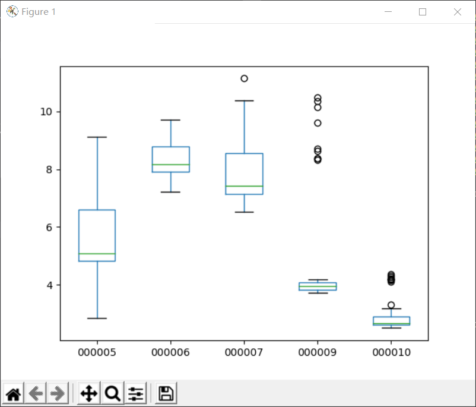  

### 异常数据分析
000007、000009、000010的箱形图出现了几个“O”，这表示这3支股票中存在温和的异常值，于是使用describe()方法对这3组数据的均值、分位数、标准差、最值等进行异常数据初步分析
```python
print(sz7.describe())  
print(sz9.describe())
print(sz10.describe())
```
异常数据分析表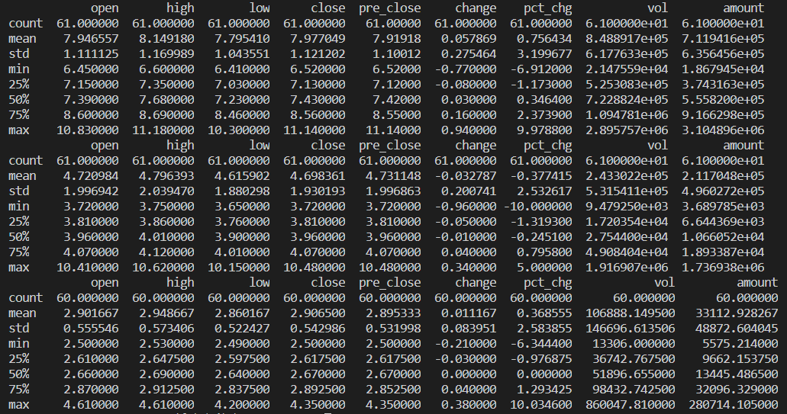 

### 绘制多只股票的对比直方图  
```python
mean_share_list = [sz5['close'].mean(), sz6['close'].mean(), sz7['close'].mean(), sz9['close'].mean(), sz10['close'].mean()] 
mean_share_series = pd.Series(mean_share_list, index=['000005', '000006', '000007', '000009', '000010'])
mean_share_series.plot(kind='bar')
plt.xticks
plt.show()
```
所获对比直方图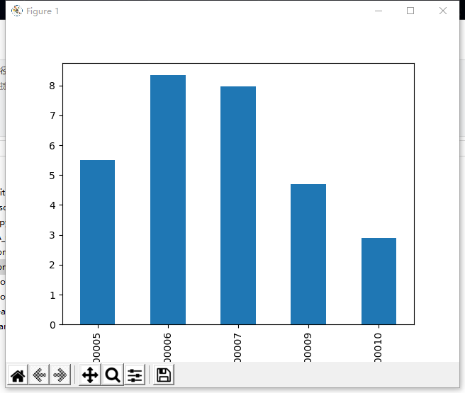  

## K线绘制
```python
# 导入第三方库
import pandas as pd
import datetime
from matplotlib.pylab import date2num
from matplotlib import pyplot as plt
from mplfinance.original_flavor import candlestick_ochl
from matplotlib import ticker as mticker 
from matplotlib import dates as mdates  
from os import close
from numpy.lib.function_base import append
from numpy.lib.type_check import mintypecode
from numpy.lib.utils import safe_eval

data = pd.read_csv('_A_stock_k_data.csv')
# 将dataframe中的日期类型转为浮点数格式
def date_to_num(dates):
    num_time = []
    for date in dates:
        date_time = datetime.datetime.strptime(date,'%Y-%m-%d')
        num_date = date2num(date_time)
        num_time.append(num_date)
    return num_time
# 构建plot_mat将转换后的数据存入其中
data_mat = data.values
num_time = date_to_num(data_mat[:,0])
plot_mat = pd.DataFrame()
plot_mat['time'] = num_time
plot_mat['open'] = data['open']
plot_mat['close'] = data['close']
plot_mat['high'] = data['high']
plot_mat['low'] = data['low']
# 调整画布，线条等颜色
fig = plt.figure(facecolor='#07000d', figsize=(15, 10))
ax = plt.subplot2grid((6, 4), (1, 0), rowspan=4, colspan=4, facecolor='#07000d')  
candlestick_ochl(ax, plot_mat[100:160].values, width=0.6, colorup='#ff1717', colordown='#53c156')
ax.grid(True, color='w')
ax.xaxis.set_major_locator(mticker.MaxNLocator(10))
ax.yaxis.set_major_locator(mticker.MaxNLocator())
ax.xaxis.set_major_formatter(mdates.DateFormatter('%Y-%m-%d'))
ax.yaxis.label.set_color('w')
ax.spines['bottom'].set_color('#5998ff')
ax.spines['top'].set_color('#5998ff')
ax.spines['left'].set_color('#5998ff')
ax.spines['right'].set_color('#5998ff')
ax.tick_params(axis='y', colors='w')
ax.tick_params(axis='x', colors='w')
plt.ylabel('Stock Price and Volume', color='w')
plt.show()
```
所得k线图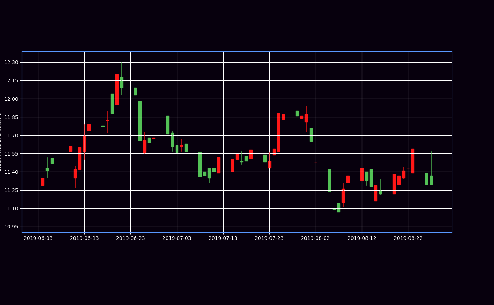
## 绘制蓝白均线图及成交量
```python
mov_avg_ten = plot_mat['close'].rolling(window=10).mean() # 计算每10天收盘价的均值，每次向下滚动1天
mov_avg_thirty = plot_mat['close'].rolling(window=30).mean()  # 计算每30天收盘价的均值，每次向下滚动1天
# 绘制10日与30日均线
ax.plot(plot_mat.time[100:160].values, mov_avg_ten[100:160], '#e1edf9', label='10days', linewidth=1.5)
ax.plot(plot_mat.time[100:160].values, mov_avg_thirty[100:160], '#4ee6fd', label='10days', linewidth=1.5)

Volume = data[['date', 'volume']].groupby(by='date').sum().reset_index()
# 绘制成交量图
ax_ = ax.twinx()  # 共享绘图区域
ax_.fill_between(plot_mat.time[100:160].values, 0, Volume.volume[100:160].values,
                facecolor='#00ffe8', alpha=0.4)  # 把[0, volume]之间空白填充颜色，alpha设置透明度
ax_.grid(False)  # 不显示成交量的网格
ax_.set_ylim(0, 4*Volume.volume.values[100:160].max())  # 成交量的y轴范围，为使成交量线处在较下方，设置刻度最大值为成交量最大值的四倍
ax_.spines['bottom'].set_color('#5998ff')
ax_.spines['top'].set_color('#5998ff')
ax_.spines['left'].set_color('#5998ff')
ax_.spines['right'].set_color('#5998ff')
ax_.tick_params(axis='y', colors='w')
ax_.tick_params(axis='x', colors='w')

```
## 绘制RSI曲线
```python
def cal_rsi(df0, period=6):  # 默认周期为6日
    df0['diff'] = df0['close'] - df0['close'].shift(1)  # 用diff储存两天收盘价的差
    df0['diff'].fillna(0, inplace=True)  # 空值填充为0
    df0['up'] = df0['diff']  # diff赋值给up
    df0['down'] = df0['diff']  # diff赋值给down
    df0['up'][df0['up'] < 0] = 0  # 把up中小于0的置零
    df0['down'][df0['down'] > 0] = 0  # 把down中大于0的置零
    df0['avg_up'] = df0['up'].rolling(period).sum() / period  # 计算period天内平均上涨点数
    df0['avg_down'] = abs(df0['down'].rolling(period).sum() / period)  # 计算period天内评价下跌点数
    df0['avg_up'].fillna(0, inplace=True)  # 空值填充为0
    df0['avg_down'].fillna(0, inplace=True)  # 空值填充为0
    df0['rsi'] = 100 - 100 / (1 + (df0['avg_up'] / df0['avg_down']))  # 计算RSI
    return df0  # 返回原DataFrame

plot_mat = cal_rsi(plot_mat)
# 绘制RSI曲线
ax0 = plt.subplot2grid((6, 4), (0, 0), sharex=ax, rowspan=1, colspan=4, facecolor='#07000d')  # 第1行第1列起画，占1行4列
col_rsi = '#c1f9f7'  # RSI曲线的颜色
col_pos = '#8f2020'  # 上辅助线及其填充色
col_neg = '#386d13'  # 下辅助线及其填充色
ax0.plot(plot_mat.time[100:160].values, plot_mat.rsi[100:160].values, col_rsi, linewidth=1.5)  # RSI曲线及其颜色，线宽
ax0.axhline(70, color=col_pos)  # 上辅助线及其颜色
ax0.axhline(30, color=col_neg)  # 下辅助线及其颜色
ax0.fill_between(plot_mat.time[100:160].values, plot_mat.rsi[100:160].values, 70, where=(plot_mat.rsi.values[100:160] >= 70),
                 facecolors=col_pos)  # 把RSI曲线大于等于70的部分填充为红色
ax0.fill_between(plot_mat.time[100:160].values, plot_mat.rsi[100:160].values, 30, where=(plot_mat.rsi.values[100:160] <= 30),
                 facecolors=col_neg)  # 把RSI曲线小于等于30的部分填充为绿色
ax0.set_yticks([30, 70])  # 设置辅助线的刻度
ax0.spines['bottom'].set_color("#5998ff")
ax0.spines['top'].set_color("#5998ff")
ax0.spines['left'].set_color("#5998ff")
ax0.spines['right'].set_color("#5998ff")
ax0.tick_params(axis='x', colors='w')
ax0.tick_params(axis='y', colors='w')
plt.ylabel('RSI', color='w')
```
蓝白线以及RSI曲线图
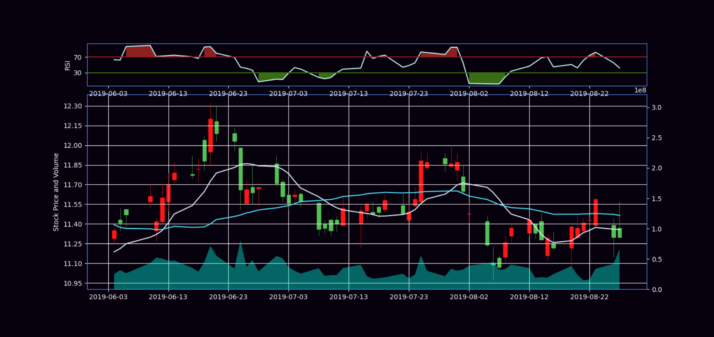

## 绘制MADC图
```python
def cal_ema(df0, period, is_dea=False):  # DEA与EMA的计算方式相同，封装在同一个函数中，用is_dea来确认是否是DEA
    for i in range(len(df0)):
        if not is_dea:
            if i == 0:
                df0.loc[i, 'ema'+str(period)] = df0.loc[i, 'close']  # EMA初始值为当天收盘价
            else:
                df0.loc[i, 'ema'+str(period)] = (2*df0.loc[i, 'close']+(period-1)*df0.loc[i-1, 'ema'+str(period)])/(period+1)  # 按公式计算
            ema = df0['ema'+str(period)]
        else:
            if i == 0:
                df0.loc[i, 'dea'+str(period)] = df0.loc[i, 'dif']
            else:
                df0.loc[i, 'dea'+str(period)] = ((period-1)*df0.loc[i-1, 'dea'+str(period)]+2*df0.loc[i, 'dif']) / (period+1)
            ema = df0['dea'+str(period)]
    return ema

def cal_macd(df0, short=12, long=26, m=9):
    short_ema = cal_ema(df0, short)  # 计算12日EMA
    long_ema = cal_ema(df0, long)  # 计算26日EMA
    df0['dif'] = short_ema - long_ema  # 计算DIF
    dea = cal_ema(df0, m, is_dea=True)  # 计算DEA
    df0['macd'] = 2 * (df0['dif'] - df0['dea'+str(m)])  # 计算MACD
    return df0

plot_mat = cal_macd(plot_mat)

fig = plt.figure(facecolor='#07000d', figsize=(15, 10))
ax = plt.subplot2grid((6, 4), (1, 0), rowspan=4, colspan=4, facecolor='#07000d')


# 绘制MACD线
ax1 = plt.subplot2grid((6, 4), (5, 0), sharex=ax, rowspan=1, colspan=4, facecolor='#07000d') # 第6行第1列起，占1行4列
ax1.plot(plot_mat.time[100:160].values, plot_mat.macd[100:160].values, color='#4ee6fd', linewidth=2)  # MACD线
ax1.plot(plot_mat.time[100:160].values, plot_mat.dea9[100:160].values, color='#e1edf9', linewidth=1)  # DEA线
ax1.fill_between(plot_mat.time[100:160].values, plot_mat.macd[100:160].values-plot_mat.dea9[100:160].values, 0,
                 alpha=0.5, facecolors='#00ffe8')  # 填充差值
ax1.yaxis.set_major_locator(mticker.MaxNLocator())  # 设置纵坐标
ax1.spines['bottom'].set_color('#5998ff')
ax1.spines['top'].set_color('#5998ff')
ax1.spines['left'].set_color('#5998ff')
ax1.spines['right'].set_color('#5998ff')
ax1.tick_params(axis='y', colors='w')
ax1.tick_params(axis='x', colors='w')
plt.ylabel('MACD', color='w')

plt.plot()
plt.show()
```
MADC图
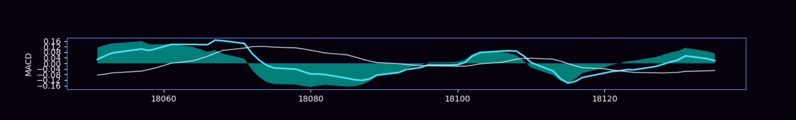

## 绘制一个汇总图
```python
fig = plt.figure(facecolor='#07000d', figsize=(15, 10))
ax = plt.subplot2grid((6, 4), (1, 0), rowspan=4, colspan=4, facecolor='#07000d')
ax.plot(plot_mat.time[100:160].values, mov_avg_ten[100:160], '#e1edf9', label='10days', linewidth=1.5)  
ax.plot(plot_mat.time[100:160].values, mov_avg_thirty[100:160], '#4ee6fd', label='10days', linewidth=1.5)
candlestick_ochl(ax, plot_mat[100:160].values, width=0.6, colorup='#ff1717', colordown='#53c156')
ax.grid(True, color='w')
ax.xaxis.set_major_locator(mticker.MaxNLocator(10))
ax.yaxis.set_major_locator(mticker.MaxNLocator())
ax.xaxis.set_major_formatter(mdates.DateFormatter('%Y-%m-%d'))
ax.yaxis.label.set_color('w')
ax.spines['bottom'].set_color('#5998ff')
ax.spines['top'].set_color('#5998ff')
ax.spines['left'].set_color('#5998ff')
ax.spines['right'].set_color('#5998ff')
ax.tick_params(axis='y', colors='w')
ax.tick_params(axis='x', colors='w')
plt.ylabel('Stock Price and Volume', color='w')
ax_ = ax.twinx()
ax_.fill_between(plot_mat.time[100:160].values, 0, Volume.volume[100:160].values,
                facecolor='#00ffe8', alpha=0.4)
ax_.grid(False)
ax_.set_ylim(0, 4*Volume.volume[100:160].values.max())
ax_.spines['bottom'].set_color('#5998ff')
ax_.spines['top'].set_color('#5998ff')
ax_.spines['left'].set_color('#5998ff')
ax_.spines['right'].set_color('#5998ff')
ax_.tick_params(axis='y', colors='w')
ax_.tick_params(axis='x', colors='w')
ax0 = plt.subplot2grid((6, 4), (0, 0), sharex=ax, rowspan=1, colspan=4, facecolor='#07000d')
col_rsi = '#c1f9f7'
col_pos = '#8f2020'
col_neg = '#386d13'
ax0.plot(plot_mat.time[100:160].values, plot_mat.rsi[100:160].values, col_rsi, linewidth=1.5)
ax0.axhline(70, color=col_pos)
ax0.axhline(30, color=col_neg)
ax0.fill_between(plot_mat.time[100:160].values, plot_mat.rsi[100:160].values, 70, where=(plot_mat.rsi.values[100:160] >= 70),
                 facecolors=col_pos)
ax0.fill_between(plot_mat.time[100:160].values, plot_mat.rsi[100:160].values, 30, where=(plot_mat.rsi.values[100:160] <= 30),
                 facecolors=col_neg)
ax0.set_yticks([30, 70])
ax0.spines['bottom'].set_color("#5998ff")
ax0.spines['top'].set_color("#5998ff")
ax0.spines['left'].set_color("#5998ff")
ax0.spines['right'].set_color("#5998ff")
ax0.tick_params(axis='x', colors='w')
ax0.tick_params(axis='y', colors='w')
plt.ylabel('RSI', color='w')
ax1 = plt.subplot2grid((6, 4), (5, 0), sharex=ax, rowspan=1, colspan=4, facecolor='#07000d') # 第6行第1列起，占1行4列
ax1.plot(plot_mat.time[100:160].values, plot_mat.macd[100:160].values, color='#4ee6fd', linewidth=2)  # MACD线
ax1.plot(plot_mat.time[100:160].values, plot_mat.dea9[100:160].values, color='#e1edf9', linewidth=1)  # DEA线
ax1.fill_between(plot_mat.time[100:160].values, plot_mat.macd[100:160].values-plot_mat.dea9[100:160].values, 0,
                 alpha=0.5, facecolors='#00ffe8')  # 填充差值
ax1.yaxis.set_major_locator(mticker.MaxNLocator())  # 设置纵坐标
ax1.spines['bottom'].set_color('#5998ff')
ax1.spines['top'].set_color('#5998ff')
ax1.spines['left'].set_color('#5998ff')
ax1.spines['right'].set_color('#5998ff')
ax1.tick_params(axis='y', colors='w')
ax1.tick_params(axis='x', colors='w')
plt.ylabel('MACD', color='w')

plt.plot()
plt.show()
```
汇总图
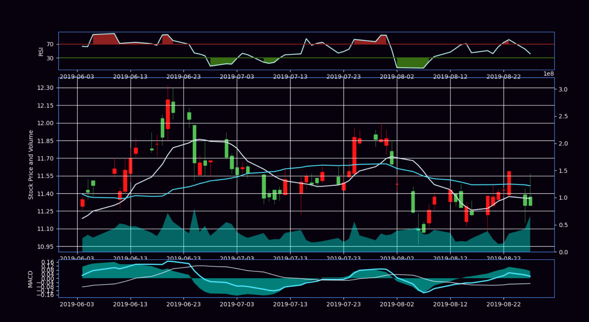

## 将图中3次出现的横坐标调整为1次
```python
fig = plt.figure(facecolor='#07000d', figsize=(15, 10))
ax = plt.subplot2grid((6, 4), (1, 0), rowspan=4, colspan=4, facecolor='#07000d')
ax.plot(plot_mat.time[100:160].values, mov_avg_ten[100:160], '#e1edf9', label='10days', linewidth=1.5)  
ax.plot(plot_mat.time[100:160].values, mov_avg_thirty[100:160], '#4ee6fd', label='10days', linewidth=1.5)
candlestick_ochl(ax, plot_mat[100:160].values, width=0.6, colorup='#ff1717', colordown='#53c156')
ax.grid(True, color='w')
ax.xaxis.set_major_locator(mticker.MaxNLocator(10))
ax.yaxis.set_major_locator(mticker.MaxNLocator())
ax.xaxis.set_major_formatter(mdates.DateFormatter('%Y-%m-%d'))
ax.yaxis.label.set_color('w')
ax.spines['bottom'].set_color('#5998ff')
ax.spines['top'].set_color('#5998ff')
ax.spines['left'].set_color('#5998ff')
ax.spines['right'].set_color('#5998ff')
ax.tick_params(axis='y', colors='w')
ax.tick_params(axis='x', colors='w')
plt.ylabel('Stock Price and Volume', color='w')
ax_ = ax.twinx()
ax_.fill_between(plot_mat.time[100:160].values, 0, Volume.volume[100:160].values,
                facecolor='#00ffe8', alpha=0.4)
ax_.grid(False)
ax_.set_ylim(0, 4*Volume.volume[100:160].values.max())
ax_.spines['bottom'].set_color('#5998ff')
ax_.spines['top'].set_color('#5998ff')
ax_.spines['left'].set_color('#5998ff')
ax_.spines['right'].set_color('#5998ff')
ax_.tick_params(axis='y', colors='w')
ax_.tick_params(axis='x', colors='w')
ax0 = plt.subplot2grid((6, 4), (0, 0), sharex=ax, rowspan=1, colspan=4, facecolor='#07000d')
col_rsi = '#c1f9f7'
col_pos = '#8f2020'
col_neg = '#386d13'
ax0.plot(plot_mat.time[100:160].values, plot_mat.rsi[100:160].values, col_rsi, linewidth=1.5)
ax0.axhline(70, color=col_pos)
ax0.axhline(30, color=col_neg)
ax0.fill_between(plot_mat.time[100:160].values, plot_mat.rsi[100:160].values, 70, where=(plot_mat.rsi.values[100:160] >= 70),
                 facecolors=col_pos)
ax0.fill_between(plot_mat.time[100:160].values, plot_mat.rsi[100:160].values, 30, where=(plot_mat.rsi.values[100:160] <= 30),
                 facecolors=col_neg)
ax0.set_yticks([30, 70])
ax0.spines['bottom'].set_color("#5998ff")
ax0.spines['top'].set_color("#5998ff")
ax0.spines['left'].set_color("#5998ff")
ax0.spines['right'].set_color("#5998ff")
ax0.tick_params(axis='x', colors='w')
ax0.tick_params(axis='y', colors='w')
plt.ylabel('RSI', color='w')
ax1 = plt.subplot2grid((6, 4), (5, 0), sharex=ax, rowspan=1, colspan=4, facecolor='#07000d')
ax1.plot(plot_mat.time[100:160].values, plot_mat.macd[100:160].values, color='#4ee6fd', linewidth=2)
ax1.plot(plot_mat.time[100:160].values, plot_mat.dea9[100:160].values, color='#e1edf9', linewidth=1)
ax1.fill_between(plot_mat.time[100:160].values, plot_mat.macd[100:160].values-plot_mat.dea9[100:160].values, 0,
                 alpha=0.5, facecolors='#00ffe8')
ax1.yaxis.set_major_locator(mticker.MaxNLocator())
ax1.spines['bottom'].set_color('#5998ff')
ax1.spines['top'].set_color('#5998ff')
ax1.spines['left'].set_color('#5998ff')
ax1.spines['right'].set_color('#5998ff')
ax1.tick_params(axis='y', colors='w')
ax1.tick_params(axis='x', colors='w')
plt.ylabel('MACD', color='w')

plt.setp(ax.get_xticklabels(), visible=False)  # 隐藏ax的x轴
plt.setp(ax0.get_xticklabels(), visible=False)  # 隐藏ax0的x轴
plt.suptitle('K lines', color='w')  # 绘制标题
plt.plot()
plt.show()
```
修改横坐标后的汇总图
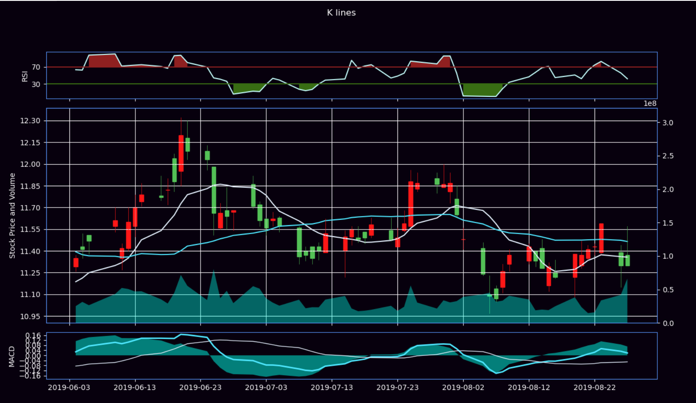